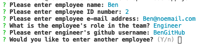

# TemplateEngine

Template Engine - Employee Summary - Week 10 Homework Assignment 

<h4>User Story</h4>
As a manager, I want to generate a webpage that displays my team's basic info, so that I have quick access to emails and GitHub profiles.

<h4>Project Instructions</h4>
Build a Node CLI that takes in informatino to create a software engineering team generator command line application. The application will prompt the user for information about the team manager and then information about the team members. The user can input any number of team members, and they may be a mix of engineers and interns. This assignment must also pass all unit tests. When the user has completed building the team, the application will create an HTML file that displays a nicely formatted team roster based on the information provided by the user. The different employee types should all inherit some methods and properties from a base class of Employee.

<h4>Classes</h4>
The project must have the these classes: Employee, Manager, Engineer,
Intern. The tests for these classes in the tests directory must all pass.
The first class is an Employee parent class with the following properties and
methods:

<ul>
<li>name</li>
<li>id</li>
<li>email</li>
<li>getName()</li>
<li>getId()</li>
<li>getEmail()</li>
<li>getRole() // Returns 'Employee'</li>
</ul>

The other three classes will extend Employee. In addition to Employee's properties and methods, Manager will also have:

<ul>
<li>officeNumber</li>
<li>getRole() // Overridden to return 'Manager'</li>
</ul>

In addition to Employee's properties and methods, Engineer will also have:

<ul>
<li>github  // GitHub username</li>
<li>getGithub()</li>
<li>getRole() // Overridden to return 'Engineer'</li>
</ul>

In addition to Employee's properties and methods, Intern will also have:

<ul>
<li>school</li>
<li>getSchool()</li>
<li>getRole() // Overridden to return 'Intern'</li>
</ul>

<h4>User Instructions</h4>
<ol>
<li>Clone repository.</li>
<li>In terminal, complete an npm i</li>
<li>Run node app.js</li>
<li>Answer the terminal questions</li>

<li>View the HTML page</li>
<ol>